# System Report: EDA Pipeline & Dashboard

**Project:** MESSM Exploratory Data Analysis
**Stack:** Snakemake · DuckDB · Streamlit · PyTorch · KNMI API

---

## Table of Contents

1. [Pipeline Overview](#1-pipeline-overview)
2. [Rule Dependency Graph](#2-rule-dependency-graph)
3. [Cleaning Pipeline — EarneCleaner](#3-cleaning-pipeline--earnecleaner)
4. [Analysis Rules](#4-analysis-rules)
5. [Dashboard Overview](#5-dashboard-overview)
6. [DuckDB View Hierarchy](#6-duckdb-view-hierarchy)
7. [Dashboard Sections](#7-dashboard-sections)
8. [Configuration Reference](#8-configuration-reference)

---

## 1. Pipeline Overview

The pipeline ingests raw CSV exports from smart meters and solar inverters, cleans and merges them into a Hive-partitioned dataset, joins them with meteorological observations from KNMI, then pre-computes analytical artefacts consumed by the dashboard.

```
Raw CSVs (data/)
    │
    ▼
[Snakemake Pipeline]
    │
    ├─ Metadata extraction & validation
    ├─ Per-file cleaning (Hampel + Kalman)
    ├─ Device-level merge (SM + Inverter)
    ├─ Hive partitioning (MAC / year)
    ├─ Weather fetch (KNMI API → Hive)
    └─ Analysis pre-computation
            │
            ▼
    output/clean_data_hive/    ← partitioned energy data
    output/weather_hive/       ← partitioned weather data
    output/calculations/       ← pre-computed parquets + JSON
            │
            ▼
    [Streamlit Dashboard]
    DuckDB in-memory views → interactive exploration
```

---

## 2. Rule Dependency Graph

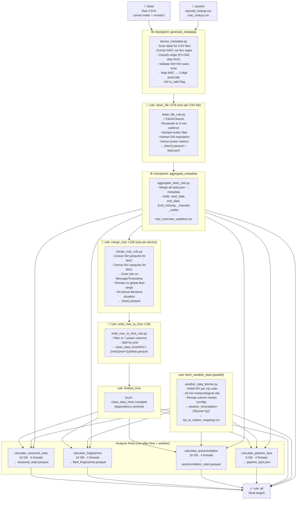

**Resource scheduling:** The global `max_mem_mb = 25,538` cap (80 % of 31 GB) prevents the scheduler from running two 16 GB analysis rules simultaneously. The 8 GB KPI rule can overlap with one 16 GB rule.

---

## 3. Cleaning Pipeline — EarneCleaner

Each raw CSV goes through `EarneCleaner.process_single_file()` in `src/time_series_cleanup.py`.

```mermaid
flowchart TD
    CSV["📄 Raw CSV\nsep=';'  decimal=','"]

    subgraph LOAD["Step 1 — Load & Schematize"]
        L1["Read CSV\nDrop 100%-null columns"]
        L2["Parse MessageTimestamp → UTC\nCast numeric cols to float32"]
    end

    subgraph PREP["Step 2 — Prepare Time Series"]
        P1["De-duplicate timestamps\n(keep first)"]
        P2["Resample to 5-min cadence\n(mean aggregation)"]
        P3["Drop data before 2021-01-01"]
        P4["Reindex to continuous grid\n(pd.date_range, freq='5min')"]
    end

    subgraph STD["Step 3 — Standardize Power Metrics"]
        S1["Smart Meter path:\nconsumption_w = Δ(IMPORT_LOW + IMPORT_NORMAL) / Δt × 1000\ngeneration_w  = Δ(EXPORT_LOW + EXPORT_NORMAL) / Δt × 1000"]
        S2["Inverter path:\ninverter_w = EXPORT_KWH → kWh→W conversion\n(fallback: EXPORT_W × 1000, or EXPORT_KW × 1000)"]
        S3["Invalidate on:\n- time gap > cadence × 1.1\n- negative energy delta\n- jump from midnight reset"]
        S4["Hard clip: values > 25 kW → 25 kW"]
    end

    subgraph HAMPEL["Step 4 — Hampel Outlier Filter"]
        H1["Sliding window = 10 samples (50 min)\nThreshold = 3 × MAD\nReplace spike → window median\nTrack {col}_outlier count"]
    end

    subgraph KALMAN["Step 5 — Kalman EM Imputation"]
        K1["Per column:\nSubsample series to ≤ 2016 pts\n(≈1 week at 5-min cadence)"]
        K2["Warm-start Q, R\nvia Method of Moments:\nQ ≈ 0.5 × Var(Δx_obs)\nR ≈ Var(rolling residuals)"]
        K3["5 × EM iterations:\nE-step: Forward Kalman + RTS Backward smoother\nM-step: Update Q, R from state dynamics"]
        K4["Apply smoother on full series\nNighttime prior (6PM–6AM):\nBlend x̂ → 0 for generation/inverter"]
        K5["Clip imputed values ≥ 0\nRecord {col}_imputed mask"]
    end

    subgraph LIT["Step 6 — Literature Situation"]
        LT1["net_demand = consumption_w − generation_w"]
        LT2["self_consumption_w = (inverter_w − generation_w).clip(0)"]
        LT3["load = consumption_w + self_consumption_w"]
        LT4["Identity check:\n|net_demand − (load − inverter_w)| ≤ 5 W\n→ warn if violated"]
    end

    subgraph STATS["Step 7 — Stats Collection"]
        ST1["missing_stats(): count NaN per col\ndate_range_stats(): min/max timestamp\n→ written to {stem}.stats.json"]
    end

    OUT1["📦 {stem}.parquet\nIntermediate cleaned file"]
    OUT2["📄 {stem}.stats.json\nCleaning statistics"]

    CSV --> LOAD --> PREP --> STD --> HAMPEL --> KALMAN --> LIT --> STATS
    STATS --> OUT1 & OUT2
```

---

## 4. Analysis Rules

All four analysis rules share the same data setup via `setup_analysis_con()` in `src/analysis_utils.py`, which builds the DuckDB view stack described in §6.

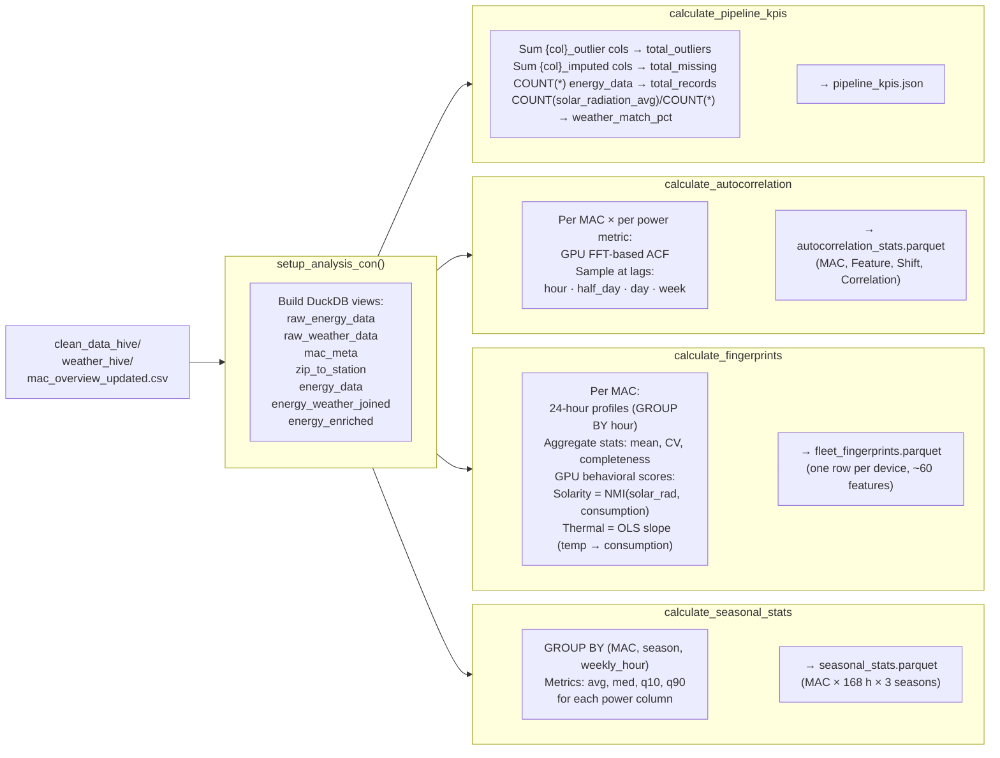

---

## 5. Dashboard Overview

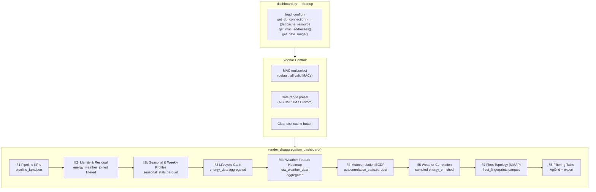

---

## 6. DuckDB View Hierarchy

Every query in the dashboard and analysis rules operates through this layered view stack:

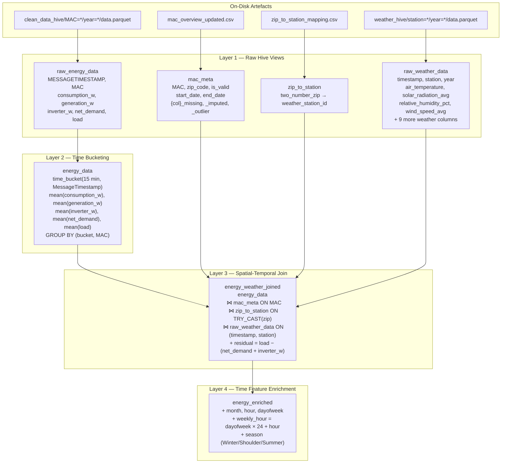

**Important:** Views are lazy (DuckDB defers execution until a query runs). Predicate pushdown through view layers is handled by DuckDB's optimizer, and Hive partitioning on `MAC` and `year` means filters like `WHERE MAC IN (...)` skip irrelevant Parquet files entirely.

---

## 7. Dashboard Sections

### §1 — Pipeline KPIs
```
Source: output/calculations/pipeline_kpis.json  (read once, no query)

┌───────────────────┬────────────────────────┬─────────────────────────┐
│  Total Records    │  Outliers Corrected    │  Missing Recovered      │
│  21,272,304       │  17,703,984 (Hampel)   │  15,176,609 (Kalman)    │
└───────────────────┴────────────────────────┴─────────────────────────┘
```

### §2 — Physical Identity & Residual Analysis
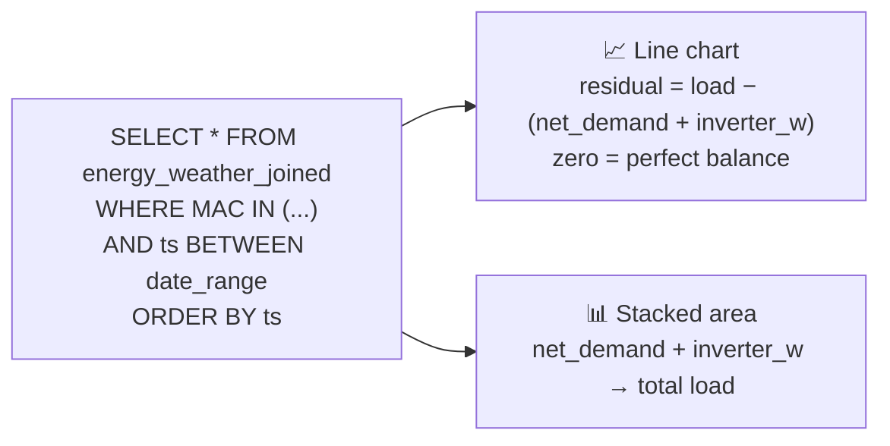

### §2b — Seasonal & Weekly Profiles
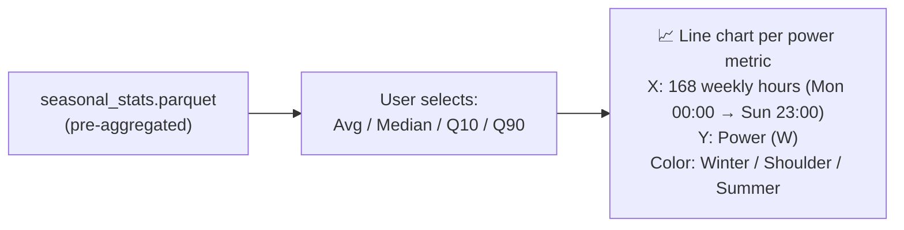

### §3 — MAC Lifecycle Gantt & Weather Heatmap
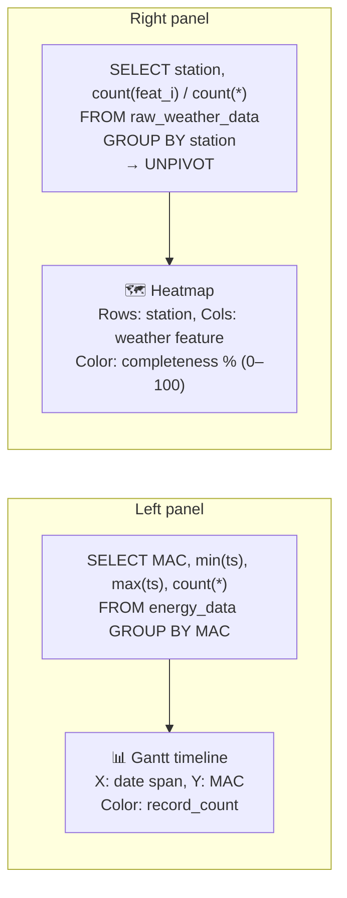

### §4 — Autocorrelation ECDF
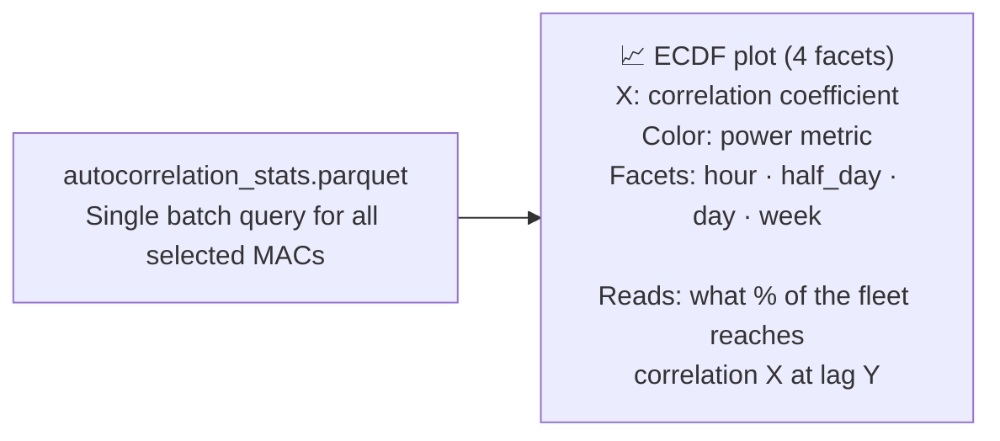
Interpretation: a steep ECDF near 1.0 at the day lag means the fleet has strong 24 h periodicity — good signal for disaggregation training.

### §5 — Weather & Energy Correlation
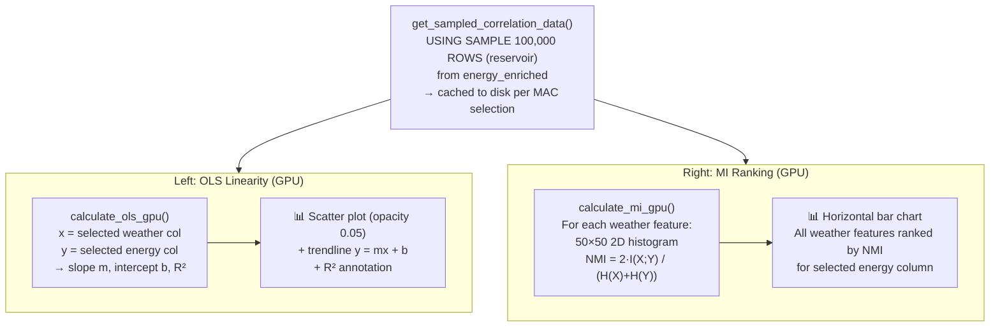

### §7 — Fleet Topology (UMAP)
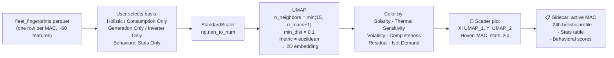

### §8 — Filtering & Model-Ready Selection
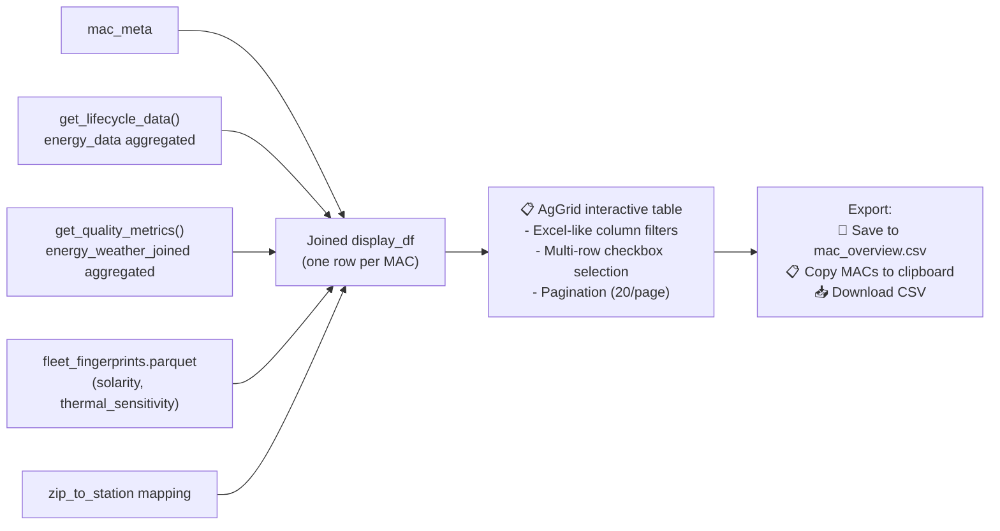

---

## 8. Configuration Reference

| Key | Default | Effect |
|-----|---------|--------|
| `cleaning.cadence_minutes` | `5` | Resampling frequency of raw CSVs |
| `cleaning.hampel_window` | `10` | Sliding window for outlier detection (samples) |
| `cleaning.hampel_sigma` | `3` | MAD threshold for spike detection |
| `cleaning.drop_values_before` | `01-01-2021` | Temporal cutoff for all devices |
| `cleaning.tolerance` | `5` | Identity check tolerance in Watts |
| `cleaning.kalman.use_em` | `true` | Enable EM Q/R estimation per column |
| `cleaning.kalman.transition_covariance` | `0.1` | Kalman Q init (process noise) |
| `cleaning.kalman.observation_covariance` | `1.0` | Kalman R init (measurement noise) |
| `cleaning.which_mac` | `"all"` | Run on subset or all devices |
| `dashboard.cadence_minutes` | `15` | Display resolution (time-bucketing in DuckDB) |
| `dashboard.power_metrics` | `[consumption_w, generation_w, inverter_w, net_demand, load]` | Columns loaded and visualized |
| `weather.start_year` | `2021` | First year to fetch from KNMI |
| `weather.request_delay` | `0.5` | Rate-limit delay between API calls (s) |
| `resources.max_mem_mb` | `25538` | Snakemake global memory cap (80 % of RAM) |
| `resources.max_cores` | `12` | Max parallel threads for Snakemake jobs |

---

*Generated 2026-03-26*
